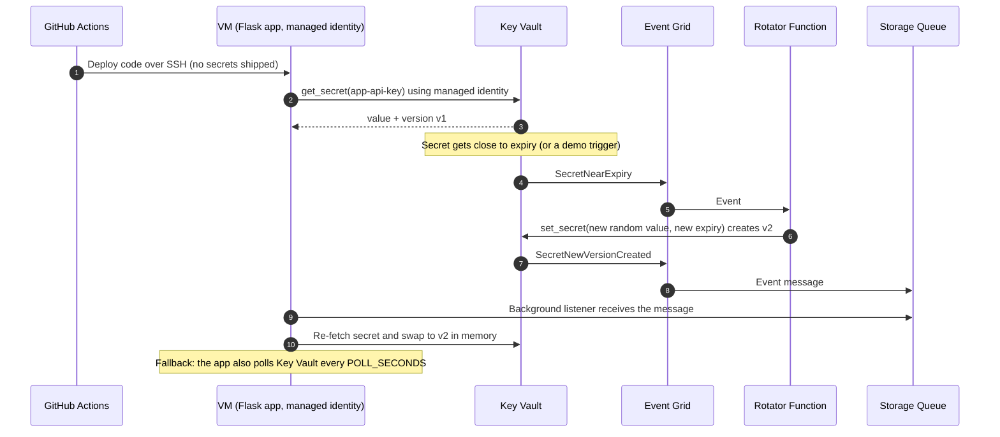

# Azure Key Vault Secret Rotation Demo (VM + GitHub Actions)

A small Python web app runs on an Azure VM and reads a secret (`app-api-key`) from Azure Key Vault using the VM's **managed identity**. No secret is stored in code, on disk, or in GitHub.

The secret is **auto-rotated** by an Azure Function. When a new version appears, the VM app **picks it up automatically** with no restart and no redeploy.

The demo shows:

1. A VM app that reads a secret from Key Vault using a managed identity.
2. Deployment to the VM through GitHub Actions.
3. An automatic rotation policy for the secret.
4. How the VM learns that the secret was rotated and syncs to the new value.
5. Commands to trigger a rotation live on stage.

---

## Architecture



### How does the VM know the secret was rotated?

The app uses two mechanisms together:

| Mechanism | How it works | Latency |
|---|---|---|
| **Push (event-driven)** | Key Vault emits `SecretNewVersionCreated`. Event Grid sends it to a Storage Queue. A background thread in the app reads the queue and reloads the secret. | About 5–15 seconds |
| **Pull (safety net)** | Every `POLL_SECONDS`, the app calls `get_secret()` and compares the version ID. | Up to `POLL_SECONDS` |

A Storage Queue is used rather than a webhook to the VM. This means the VM needs **no public HTTPS endpoint**, and it can still catch up on missed events after a restart.

### About "rotation policy" for secrets

Key Vault's built-in **rotation policy** (`az keyvault key rotation-policy`) applies to **keys**, because Key Vault can generate key material itself. For **secrets**, Microsoft's documented pattern is different:

- Set an **expiry** on the secret.
- Key Vault fires a `SecretNearExpiry` event about **30 days before expiry**.
- An **Azure Function** receives the event, generates a new value, and writes a new version with a new expiry.

That is what this demo builds. An appendix at the end shows the native key rotation policy as well.

> **Rotation interval:** new expiry = desired rotation interval + 30 days.
> For example, to rotate every 60 days, set the expiry to 90 days. The near-expiry event then fires on day 60.
>
> Always check the current Azure docs, because these features evolve over time.

---

## Repository layout

```
kv-rotation-demo/
├── README.md
├── .gitignore
├── .github/workflows/
│   └── deploy.yml                # CI/CD: GitHub Actions -> VM
├── app/                          # Runs on the VM
│   ├── app.py                    # Flask app: reads secret, syncs on rotation
│   └── requirements.txt
├── deploy/
│   ├── kvdemo.service            # systemd unit
│   └── kvdemo.env.example        # What /etc/kvdemo.env looks like (no secrets)
├── rotator/                      # Azure Function (auto-rotation)
│   ├── function_app.py
│   ├── host.json
│   ├── requirements.txt
│   └── .funcignore
├── scripts/
│   ├── 00-env.sh                 # Shared names (saved once to .demo.env)
│   ├── 01-keyvault.sh            # Key Vault + secret with expiry
│   ├── 02-vm.sh                  # VM + managed identity
│   ├── 03-events.sh              # Storage Queue + Event Grid (VM sync)
│   ├── 04-vm-bootstrap.sh        # /etc/kvdemo.env on the VM
│   ├── 05-rotator.sh             # Function + rotation policy wiring
│   ├── demo-watch.sh             # 🎬 watch the app's secret version
│   ├── demo-logs.sh              # 🎬 tail the app logs on the VM
│   ├── rotate-auto.sh            # 🎬 Option A: fire real auto-rotation
│   ├── rotate-now.sh             # 🎬 Option B: manual rotation
│   ├── rotate-near-expiry.sh     # 🎬 Option C: let Azure trigger it
│   ├── verify.sh                 # Key Vault versions vs app version
│   └── cleanup.sh
└── extras/key-rotation/          # Appendix: native rotation policy (keys)
    ├── policy.json
    └── key-rotation-demo.sh
```

## ⚡ Quick start (scripts)

Every step below is also a script, so you can run the whole setup without copy-pasting. The sections after this one explain what each script does.

```bash
az login
chmod +x scripts/*.sh

./scripts/01-keyvault.sh       # Key Vault + secret
./scripts/02-vm.sh             # VM + managed identity
./scripts/03-events.sh         # queue + Event Grid (how the VM learns about rotation)
./scripts/04-vm-bootstrap.sh   # VM config; prints the GitHub secrets to add
# -> add VM_HOST / VM_USER / VM_SSH_KEY in GitHub, push to main (deploys the app)
./scripts/05-rotator.sh        # auto-rotation Function + policy

# 🎬 Demo
./scripts/demo-watch.sh        # terminal 1
./scripts/rotate-auto.sh       # terminal 2 (or rotate-now.sh)
./scripts/verify.sh
./scripts/cleanup.sh           # when done
```

> The resource names are generated once and saved in `.demo.env`, which is git-ignored. Edit that file to change the region or names. To use them in your own shell, run `source scripts/00-env.sh`.

---

## 0. Prerequisites

- Azure CLI 2.60 or later, logged in with `az login`
- Azure Functions Core Tools v4 (`func`)
- A GitHub repository with Actions enabled
- `openssl` on your machine

```bash
# ---- Demo variables (edit these) ----
export RG=kv-demo-rg
export LOC=centralindia
export KV=kvdemo$RANDOM            # must be globally unique
export ST=kvdemost$RANDOM          # storage account: lowercase, 3-24 characters
export VM=kvdemo-vm
export FUNC=kvdemo-rotator-$RANDOM
export SECRET_NAME=app-api-key
export QUEUE=kv-events

az provider register -n Microsoft.EventGrid
az group create -n $RG -l $LOC
```

---

## 1. Create the Key Vault and the secret

```bash
az keyvault create -n $KV -g $RG -l $LOC --enable-rbac-authorization true
export KV_ID=$(az keyvault show -n $KV --query id -o tsv)

# Give yourself permission to manage secrets
ME=$(az ad signed-in-user show --query id -o tsv)
az role assignment create --assignee $ME --role "Key Vault Secrets Officer" --scope $KV_ID
# Role assignments can take 1-2 minutes to take effect

# Create the secret with an expiry and a rotation tag
az keyvault secret set --vault-name $KV -n $SECRET_NAME \
  --value "$(openssl rand -base64 24)" \
  --expires "$(date -u -d '+90 days' '+%Y-%m-%dT%H:%M:%SZ')" \
  --tags rotationDays=90
```

> On macOS, use `date -u -v+90d '+%Y-%m-%dT%H:%M:%SZ'` instead.

---

## 2. Create the VM with a managed identity

```bash
az vm create -g $RG -n $VM \
  --image Ubuntu2204 --size Standard_B1s \
  --admin-username azureuser --generate-ssh-keys \
  --assign-identity --public-ip-sku Standard

az vm open-port -g $RG -n $VM --port 8080 --priority 1010

export VM_IP=$(az vm show -d -g $RG -n $VM --query publicIps -o tsv)
export VM_PRINCIPAL=$(az vm identity show -g $RG -n $VM --query principalId -o tsv)

# The VM can READ secrets, and nothing else
az role assignment create --assignee-object-id $VM_PRINCIPAL \
  --assignee-principal-type ServicePrincipal \
  --role "Key Vault Secrets User" --scope $KV_ID
```

---

## 3. Create the queue and the Event Grid subscription for "secret rotated"

```bash
az storage account create -n $ST -g $RG -l $LOC --sku Standard_LRS
export ST_ID=$(az storage account show -n $ST -g $RG --query id -o tsv)
az storage queue create -n $QUEUE --account-name $ST

# The VM can receive and delete queue messages
az role assignment create --assignee-object-id $VM_PRINCIPAL \
  --assignee-principal-type ServicePrincipal \
  --role "Storage Queue Data Message Processor" --scope $ST_ID

# Event Grid system topic on the Key Vault
az eventgrid system-topic create -g $RG -n kv-topic -l $LOC \
  --topic-type Microsoft.KeyVault.vaults --source $KV_ID

# New secret version -> queue (the VM listens to this queue)
az eventgrid system-topic event-subscription create -g $RG \
  --system-topic-name kv-topic -n secret-new-version-to-queue \
  --endpoint-type storagequeue \
  --endpoint "$ST_ID/queueservices/default/queues/$QUEUE" \
  --included-event-types Microsoft.KeyVault.SecretNewVersionCreated \
  --subject-begins-with $SECRET_NAME
```

---

## 4. The application

### `app/requirements.txt`

```
flask==3.0.3
gunicorn==22.0.0
azure-identity>=1.17
azure-keyvault-secrets>=4.8
azure-storage-queue>=12.10
```

### `app/app.py`

```python
import base64
import json
import logging
import os
import threading
import time
from datetime import datetime, timezone

from azure.identity import DefaultAzureCredential
from azure.keyvault.secrets import SecretClient
from azure.storage.queue import QueueClient
from flask import Flask, jsonify

logging.basicConfig(level=logging.INFO, format="%(asctime)s %(levelname)s %(message)s")
log = logging.getLogger("kvdemo")

KEYVAULT_URL = os.environ["KEYVAULT_URL"]               # https://<kv>.vault.azure.net
SECRET_NAME = os.environ.get("SECRET_NAME", "app-api-key")
QUEUE_ACCOUNT_URL = os.environ.get("QUEUE_ACCOUNT_URL")  # https://<st>.queue.core.windows.net
QUEUE_NAME = os.environ.get("QUEUE_NAME", "kv-events")
POLL_SECONDS = int(os.environ.get("POLL_SECONDS", "60"))

credential = DefaultAzureCredential()  # resolves to the VM's managed identity
kv = SecretClient(vault_url=KEYVAULT_URL, credential=credential)

lock = threading.Lock()
state = {"value": None, "version": None, "loaded_at": None, "history": []}


def now():
    return datetime.now(timezone.utc).strftime("%Y-%m-%d %H:%M:%S UTC")


def load_secret(reason: str):
    s = kv.get_secret(SECRET_NAME)  # always returns the latest version
    with lock:
        if s.properties.version != state["version"]:
            state.update(value=s.value, version=s.properties.version, loaded_at=now())
            state["history"].insert(0, {"version": s.properties.version, "at": now(), "reason": reason})
            log.info("Secret loaded: version=%s reason=%s", s.properties.version, reason)
        else:
            log.info("Checked (%s): no change, version=%s", reason, s.properties.version)


def mask(v):
    return (v[:4] + "*" * 12) if v else None


# ---- Pull: poll Key Vault as a safety net ----
def poll_loop():
    while True:
        time.sleep(POLL_SECONDS)
        try:
            load_secret("poll")
        except Exception:
            log.exception("poll failed")


# ---- Push: Event Grid -> Storage Queue -> reload ----
def parse(msg_content: str) -> dict:
    try:
        return json.loads(msg_content)
    except json.JSONDecodeError:
        return json.loads(base64.b64decode(msg_content))


def queue_loop():
    qc = QueueClient(account_url=QUEUE_ACCOUNT_URL, queue_name=QUEUE_NAME, credential=credential)
    log.info("Listening for rotation events on queue '%s'", QUEUE_NAME)
    while True:
        try:
            for msg in qc.receive_messages(messages_per_page=10, visibility_timeout=30):
                evt = parse(msg.content)
                etype = evt.get("eventType", "")
                subject = evt.get("subject", "")
                log.info("Event received: %s subject=%s", etype, subject)
                if etype.endswith("SecretNewVersionCreated") and subject == SECRET_NAME:
                    load_secret("event-grid")
                qc.delete_message(msg)
        except Exception:
            log.exception("queue listener error")
        time.sleep(5)


app = Flask(__name__)


@app.get("/healthz")
def healthz():
    return "ok"


@app.get("/api/secret")
def api_secret():
    with lock:
        return jsonify(name=SECRET_NAME, version=state["version"], masked_value=mask(state["value"]),
                       loaded_at=state["loaded_at"], history=state["history"][:10])


@app.post("/api/refresh")
def api_refresh():
    load_secret("manual-refresh")
    return api_secret()


@app.get("/")
def index():
    with lock:
        rows = "".join(f"<tr><td><code>{h['version'][:12]}…</code></td><td>{h['at']}</td>"
                       f"<td>{h['reason']}</td></tr>" for h in state["history"][:10])
        return f"""<!doctype html><html><head><meta http-equiv="refresh" content="3">
<title>Key Vault Rotation Demo</title>
<style>body{{font-family:system-ui;max-width:720px;margin:40px auto;padding:0 16px}}
.card{{border:1px solid #ccc;border-radius:10px;padding:16px;margin-bottom:16px}}
td,th{{padding:4px 12px;text-align:left}}</style></head><body>
<h1>🔐 Key Vault Rotation Demo</h1>
<div class="card"><b>Secret:</b> {SECRET_NAME}<br>
<b>Current version:</b> <code>{state['version']}</code><br>
<b>Value (masked):</b> <code>{mask(state['value'])}</code><br>
<b>Loaded at:</b> {state['loaded_at']}</div>
<form method="post" action="/api/refresh"><button>Force refresh</button></form>
<h3>Version history (this app instance)</h3>
<table><tr><th>Version</th><th>Loaded</th><th>Trigger</th></tr>{rows}</table>
<p><small>Page auto-refreshes every 3 seconds. Poll interval: {POLL_SECONDS}s.</small></p>
</body></html>"""


# Start-up: load the secret once, then start the background sync threads
load_secret("startup")
threading.Thread(target=poll_loop, daemon=True).start()
if QUEUE_ACCOUNT_URL:
    threading.Thread(target=queue_loop, daemon=True).start()
```

### `deploy/kvdemo.service`

```ini
[Unit]
Description=Key Vault rotation demo app
After=network-online.target

[Service]
User=azureuser
WorkingDirectory=/opt/kvdemo
EnvironmentFile=/etc/kvdemo.env
# One worker: the secret cache and background threads live in process memory
ExecStart=/opt/kvdemo/venv/bin/gunicorn -w 1 --threads 4 -b 0.0.0.0:8080 app:app
Restart=always

[Install]
WantedBy=multi-user.target
```

### One-time VM bootstrap (config only, no secrets)

```bash
az vm run-command invoke -g $RG -n $VM --command-id RunShellScript --scripts "
apt-get update && apt-get install -y python3-venv
mkdir -p /opt/kvdemo && chown azureuser:azureuser /opt/kvdemo
cat > /etc/kvdemo.env <<EOF
KEYVAULT_URL=https://$KV.vault.azure.net
SECRET_NAME=$SECRET_NAME
QUEUE_ACCOUNT_URL=https://$ST.queue.core.windows.net
QUEUE_NAME=$QUEUE
POLL_SECONDS=60
EOF"
```

`/etc/kvdemo.env` holds only the vault **URL** and names. The secret value is never written to disk.

---

## 5. Deploy with GitHub Actions

### Repository secrets

Add these under **Settings → Secrets and variables → Actions**:

| Name | Value |
|---|---|
| `VM_HOST` | The value of `$VM_IP` |
| `VM_USER` | `azureuser` |
| `VM_SSH_KEY` | Contents of `~/.ssh/id_rsa`, the key `az vm create` generated |

GitHub **never** holds the Key Vault secret. It only has permission to deploy code.

### `.github/workflows/deploy.yml`

```yaml
name: Deploy to VM

on:
  push:
    branches: [main]
    paths: ["app/**", "deploy/**", ".github/workflows/deploy.yml"]
  workflow_dispatch:

jobs:
  deploy:
    runs-on: ubuntu-latest
    steps:
      - uses: actions/checkout@v4

      - name: Copy files to VM
        uses: appleboy/scp-action@v0.1.7
        with:
          host: ${{ secrets.VM_HOST }}
          username: ${{ secrets.VM_USER }}
          key: ${{ secrets.VM_SSH_KEY }}
          source: "app/*,deploy/*"
          target: /tmp/kvdemo
          overwrite: true

      - name: Install and restart
        uses: appleboy/ssh-action@v1.0.3
        with:
          host: ${{ secrets.VM_HOST }}
          username: ${{ secrets.VM_USER }}
          key: ${{ secrets.VM_SSH_KEY }}
          script: |
            set -e
            cp -r /tmp/kvdemo/app/* /opt/kvdemo/
            [ -d /opt/kvdemo/venv ] || python3 -m venv /opt/kvdemo/venv
            /opt/kvdemo/venv/bin/pip install -q -r /opt/kvdemo/requirements.txt
            sudo cp /tmp/kvdemo/deploy/kvdemo.service /etc/systemd/system/kvdemo.service
            sudo systemctl daemon-reload
            sudo systemctl enable kvdemo
            sudo systemctl restart kvdemo
            sleep 5
            curl -fsS http://localhost:8080/healthz
```

Push to `main`, then open `http://$VM_IP:8080`.

> **Production tip:** To avoid opening port 22, use `azure/login` with OIDC (federated credentials) and deploy through `az vm run-command invoke`. It is the same idea without SSH.

---

## 6. Automatic rotation (Azure Function)

### `rotator/function_app.py`

```python
import logging
import secrets
from datetime import datetime, timedelta, timezone

import azure.functions as func
from azure.identity import DefaultAzureCredential
from azure.keyvault.secrets import SecretClient

app = func.FunctionApp()


@app.event_grid_trigger(arg_name="event")
def rotate_secret(event: func.EventGridEvent):
    data = event.get_json()
    vault, name = data["VaultName"], data["ObjectName"]
    logging.info("Rotation triggered by %s for %s/%s", event.event_type, vault, name)

    client = SecretClient(f"https://{vault}.vault.azure.net", DefaultAzureCredential())
    current = client.get_secret(name)
    tags = current.properties.tags or {}
    days = int(tags.get("rotationDays", "90"))

    # For a real credential (DB password, API key), update the backing
    # system first, then store the new value in Key Vault.
    new_value = secrets.token_urlsafe(32)

    new = client.set_secret(
        name, new_value,
        expires_on=datetime.now(timezone.utc) + timedelta(days=days),
        tags=tags,
    )
    logging.info("Rotated %s -> version %s", name, new.properties.version)
```

### `rotator/requirements.txt`

```
azure-functions
azure-identity
azure-keyvault-secrets
```

### `rotator/host.json`

```json
{ "version": "2.0" }
```

### Deploy the function and wire up the rotation policy

```bash
az functionapp create -g $RG -n $FUNC --storage-account $ST \
  --flexconsumption-location $LOC --runtime python --runtime-version 3.11

az functionapp identity assign -g $RG -n $FUNC
FUNC_PRINCIPAL=$(az functionapp identity show -g $RG -n $FUNC --query principalId -o tsv)

# The rotator can WRITE secrets
az role assignment create --assignee-object-id $FUNC_PRINCIPAL \
  --assignee-principal-type ServicePrincipal \
  --role "Key Vault Secrets Officer" --scope $KV_ID

cd rotator && func azure functionapp publish $FUNC && cd ..

FUNC_ID=$(az functionapp show -g $RG -n $FUNC --query id -o tsv)

# The "rotation policy": near expiry -> rotator function
az eventgrid system-topic event-subscription create -g $RG \
  --system-topic-name kv-topic -n secret-near-expiry-rotate \
  --endpoint-type azurefunction \
  --endpoint "$FUNC_ID/functions/rotate_secret" \
  --included-event-types Microsoft.KeyVault.SecretNearExpiry \
  --subject-begins-with $SECRET_NAME
```

---

## 7. 🎬 Live demo: trigger a rotation

Open two terminals and a browser tab at `http://$VM_IP:8080`.

**Terminal 1: watch the app**

```bash
watch -n 2 "curl -s http://$VM_IP:8080/api/secret | jq '{version, masked_value, loaded_at, last: .history[0]}'"
```

Or watch the VM logs:

```bash
ssh azureuser@$VM_IP 'sudo journalctl -u kvdemo -f'
```

**Terminal 2: rotate the secret.** Pick one of the three options below.

### Option A: Run the real auto-rotation Function now (recommended)

Script: `./scripts/rotate-auto.sh`

This calls the function exactly as Event Grid would, without waiting for the expiry window.

```bash
EG_KEY=$(az functionapp keys list -g $RG -n $FUNC --query "systemKeys.eventgrid_extension" -o tsv)

curl -s -X POST \
  "https://$FUNC.azurewebsites.net/runtime/webhooks/eventgrid?functionName=rotate_secret&code=$EG_KEY" \
  -H "Content-Type: application/json" \
  -H "aeg-event-type: Notification" \
  -d "[{
    \"id\": \"$(uuidgen)\",
    \"eventType\": \"Microsoft.KeyVault.SecretNearExpiry\",
    \"subject\": \"$SECRET_NAME\",
    \"eventTime\": \"$(date -u +%Y-%m-%dT%H:%M:%SZ)\",
    \"dataVersion\": \"1\",
    \"data\": {\"VaultName\": \"$KV\", \"ObjectType\": \"Secret\", \"ObjectName\": \"$SECRET_NAME\"}
  }]"
```

> Check the default hostname with `az functionapp show -g $RG -n $FUNC --query defaultHostName -o tsv` if it differs.

### Option B: Manual rotation (fastest, no function needed)

`scripts/rotate-now.sh`:

```bash
#!/usr/bin/env bash
set -euo pipefail
source "$(dirname "$0")/00-env.sh"
az keyvault secret set --vault-name "$KV" -n "$SECRET_NAME" \
  --value "$(openssl rand -base64 24)" \
  --expires "$(future_date "$ROTATION_DAYS")" \
  --tags rotationDays="$ROTATION_DAYS" \
  --query "{name:name, newVersion:id}" -o table
```

```bash
./scripts/rotate-now.sh
```

### Option C: Let Azure do it on its own

Script: `./scripts/rotate-near-expiry.sh`

Move the expiry inside the 30-day window. Key Vault then emits `SecretNearExpiry` by itself, which usually takes minutes, not seconds, so this is less suited to a live demo.

```bash
az keyvault secret set-attributes --vault-name $KV -n $SECRET_NAME \
  --expires "$(date -u -d '+2 days' '+%Y-%m-%dT%H:%M:%SZ')"
```

### What the audience will see

1. A new version is created in Key Vault.
2. Within about 5–15 seconds, the web page shows a new **version ID** with trigger **`event-grid`**.
3. The app did **not** restart, was **not** redeployed, and GitHub was not involved.
4. If you delete the Event Grid subscription to the queue, the change still arrives through the **`poll`** fallback within `POLL_SECONDS`.

### Verify

```bash
# All versions in Key Vault
az keyvault secret list-versions --vault-name $KV -n $SECRET_NAME \
  --query "sort_by([], &attributes.created)[].{version:id, created:attributes.created, expires:attributes.expires, enabled:attributes.enabled}" -o table

# What the app is using right now
curl -s http://$VM_IP:8080/api/secret | jq

# Function logs
az webapp log tail -g $RG -n $FUNC   # or check Application Insights
```

---

## Security summary

| Component | Identity | Permission |
|---|---|---|
| VM app | System-assigned managed identity | `Key Vault Secrets User` (read only), `Storage Queue Data Message Processor` |
| Rotator Function | System-assigned managed identity | `Key Vault Secrets Officer` (write) |
| GitHub Actions | SSH key (or OIDC) | Deploys code only; no Key Vault access |
| Secret value | — | Held only in Key Vault and in the app's process memory |

---

## Appendix: Native rotation policy for **keys**

If your app uses a **key** (for example, for encryption or signing) instead of a secret, Key Vault can rotate it with no Function at all.

`policy.json`:

```json
{
  "lifetimeActions": [
    { "trigger": { "timeAfterCreate": "P30D" }, "action": { "type": "Rotate" } },
    { "trigger": { "timeBeforeExpiry": "P7D" }, "action": { "type": "Notify" } }
  ],
  "attributes": { "expiryTime": "P90D" }
}
```

```bash
# Your user also needs "Key Vault Crypto Officer" on the vault
az keyvault key create --vault-name $KV -n demo-key --kty RSA --size 2048
az keyvault key rotation-policy update --vault-name $KV -n demo-key --value policy.json
az keyvault key rotation-policy show   --vault-name $KV -n demo-key

# Demo: rotate now
az keyvault key rotate --vault-name $KV -n demo-key
```

The app can sync keys the same way. Subscribe to `Microsoft.KeyVault.KeyNewVersionCreated` instead of `SecretNewVersionCreated`.

---

## Cleanup

```bash
az group delete -n $RG --yes --no-wait
# Key Vault soft-delete keeps the vault name reserved; purge it if needed:
az keyvault purge -n $KV
```
