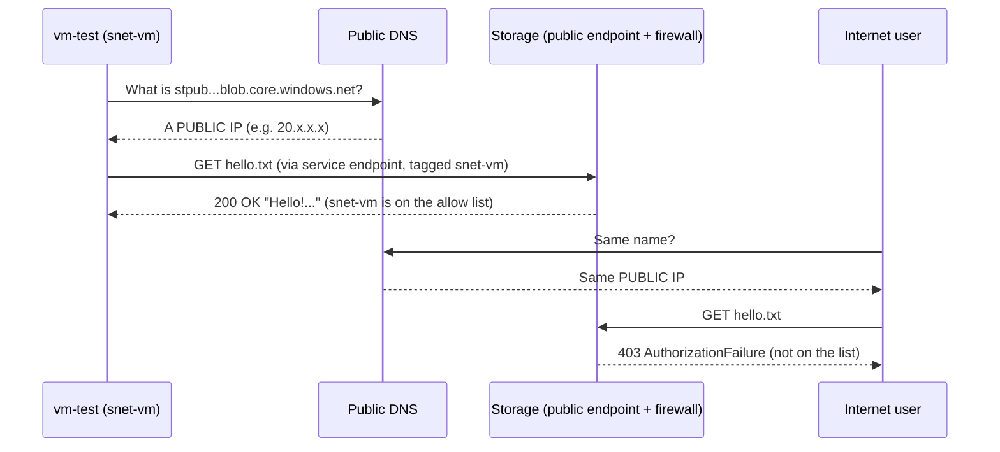
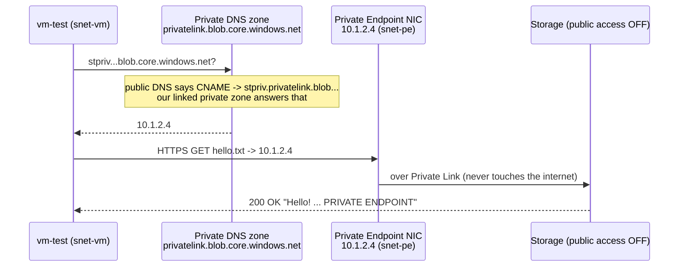
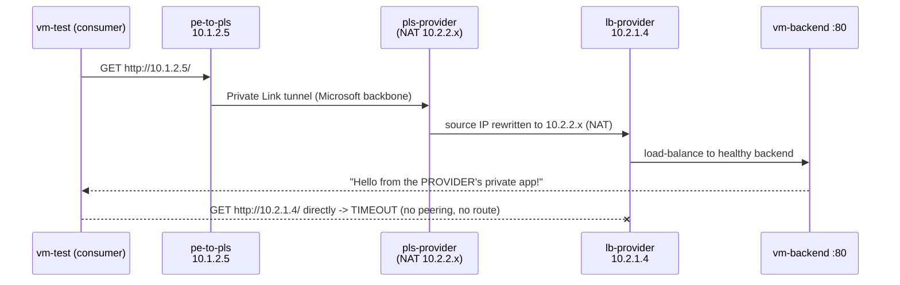
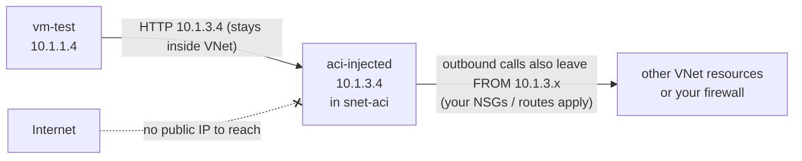
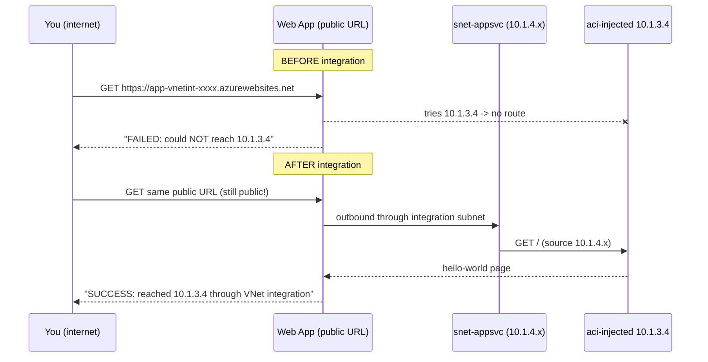
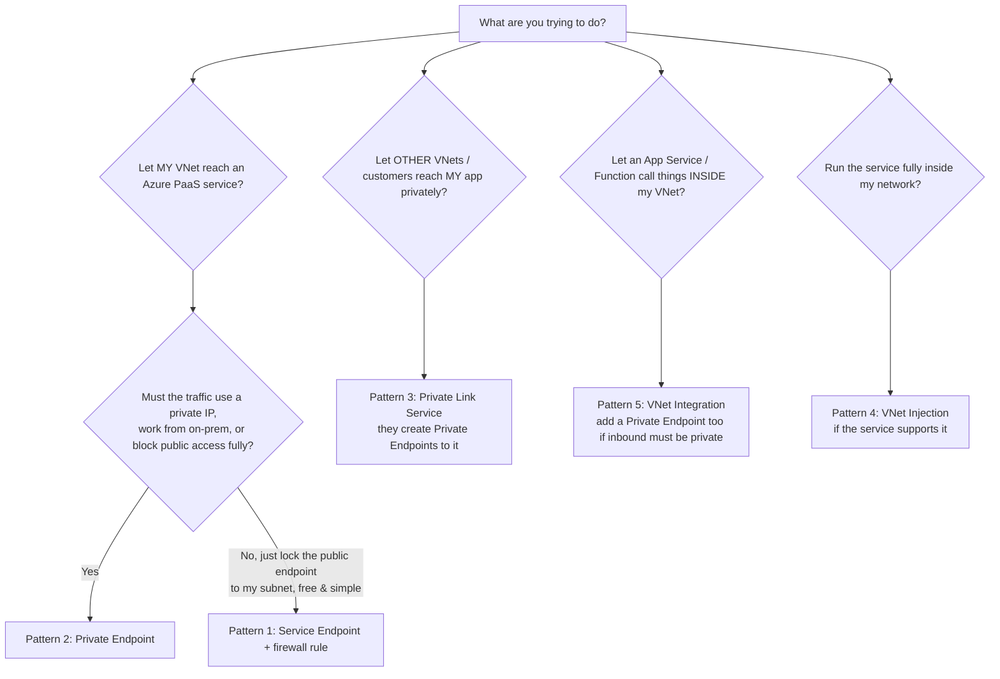

# Azure Network Access: 5 Patterns, Explained Simply (with a Hands-on Lab)

> **Who this is for:** anyone. You do not need to be a networking person.
> Each idea is explained first with an everyday story, then with an architecture picture,
> then a step-by-step traffic flow, and finally a script you can run to *see it happen*.

The five patterns people constantly mix up:

| # | Pattern | One-line meaning |
|---|---------|------------------|
| 1 | **Public endpoint, restricted to a particular VNet** (Service Endpoint + firewall) | The service keeps its **public address**, but only lets in traffic coming from your chosen subnet. |
| 2 | **Private Endpoint** | The service gets a **private IP inside your VNet**; its public door can be shut. |
| 3 | **Private Link Service** | **You** publish **your own** app so *other* people can create a Private Endpoint to it. |
| 4 | **VNet Injection** | The Azure service is **deployed inside your subnet**. It lives with you, fully. |
| 5 | **VNet Integration** | The service stays outside, but gets an **outbound-only** tunnel **into** your VNet. |

---

## Table of contents

1. [First, the basic words (2-minute primer)](#1-first-the-basic-words-2-minute-primer)
2. [The story we use: a gated housing society](#2-the-story-we-use-a-gated-housing-society)
3. [The lab architecture (what the scripts build)](#3-the-lab-architecture-what-the-scripts-build)
4. [Pattern 1 - Public endpoint restricted to a VNet](#4-pattern-1--public-endpoint-restricted-to-a-particular-vnet)
5. [Pattern 2 - Private Endpoint](#5-pattern-2--private-endpoint)
6. [Pattern 3 - Private Link Service](#6-pattern-3--private-link-service)
7. [Pattern 4 - VNet Injection](#7-pattern-4--vnet-injection)
8. [Pattern 5 - VNet Integration](#8-pattern-5--vnet-integration)
9. [Side-by-side comparison (the cheat sheet)](#9-side-by-side-comparison-the-cheat-sheet)
10. [Which one do I need? (decision guide)](#10-which-one-do-i-need-decision-guide)
11. [Common confusions, cleared up](#11-common-confusions-cleared-up)
12. [How to run the lab](#12-how-to-run-the-lab)
13. [Troubleshooting](#13-troubleshooting)
14. [Glossary](#14-glossary)

---

## 1. First, the basic words (2-minute primer)

| Word | Plain-English meaning |
|------|-----------------------|
| **VNet** (Virtual Network) | Your own private network in Azure. Think of it as a **gated society**: things inside can talk to each other; outsiders can't walk in. |
| **Subnet** | A **lane/block** inside the society (e.g. "Block A = 10.1.1.x"). |
| **Private IP** | A house number that only makes sense **inside** the society (like `10.1.2.5`). The outside world can't reach it. |
| **Public IP** | A street address on the **public road** that anyone on the internet can find. |
| **PaaS service** | A ready-made Azure service you don't manage the servers for (Storage, SQL, App Service...). By default these live **outside** your VNet on Microsoft's side, with a public address. |
| **DNS** | The **phone book** that turns a name (`mystorage.blob.core.windows.net`) into an address (IP). |
| **Inbound** | Someone calling **into** the service. |
| **Outbound** | The service calling **out** to something else. |

**The single most useful question for this whole topic:**

> *"Which direction is the traffic going, and where does the service actually live?"*

Every one of the five patterns is a different answer to that question.

---

## 2. The story we use: a gated housing society

Picture **your VNet as a gated housing society** and Azure services as **shops**.

| Pattern | The story |
|---------|-----------|
| **1. Public endpoint + VNet restriction** | The shop stays on the **public high street**. But it hires a **bouncer** who only lets in people wearing *your society's ID badge*. Your residents get a special lane (the *service endpoint*) that stamps the badge on them. Everyone else is turned away, but they can still **see** the shop and walk up to its door. |
| **2. Private Endpoint** | The shop opens a **private counter inside your society** (it gets a flat number, e.g. `10.1.2.5`). You update the society's phone book so the shop's name points to that flat. Then the shop **bricks up its high-street door**. |
| **3. Private Link Service** | Now **you are the shop owner**. You set up a **franchise system**: other societies can open a counter of *your* shop inside *their* society, without your society and theirs ever being connected. |
| **4. VNet Injection** | The shop **moves into your society entirely** and rents a flat there (a *delegated subnet*). It lives by the society rules; people come in privately, and it goes out through the society's gate. |
| **5. VNet Integration** | The shop stays on the high street, still open to the public. But you give its **delivery person a back-gate key**, so the shop can **go into** your society to fetch things. It's a **one-way** key: it does not let society residents reach the shop privately. |

Keep this story in mind; each section below maps back to it.

---

## 3. The lab architecture (what the scripts build)

Everything lives in one resource group (`rg-network-demo`) so cleanup is one command.

```
                                   INTERNET  (your laptop / Azure Cloud Shell)
                                       |
   ====================================|===========================================================
   AZURE                               |
                                       |
   +-----------------------------------v-------------------------------+     +------------------------------------+
   |  vnet-consumer   10.1.0.0/16      ("OUR" network)                  |     | vnet-provider  10.2.0.0/16         |
   |                                                                   |     | ("SOMEONE ELSE's" network)         |
   |  snet-vm      10.1.1.0/24  [vm-test]  <-- we test FROM here        |     |  ** NOT PEERED with consumer **    |
   |               + NAT gateway (outbound internet)                   |     |                                    |
   |               + Service Endpoint: Microsoft.Storage   (Demo 1)    |     |  snet-backend 10.2.1.0/24          |
   |                                                                   |     |     [lb-provider] internal LB      |
   |  snet-pe      10.1.2.0/24  [pe-storage] -> stpriv...   (Demo 2)    |     |     [vm-backend]  tiny web server  |
   |                            [pe-to-pls]  -> pls-provider (Demo 3) -+-----+->                                  |
   |                                                                   |     |  snet-pls     10.2.2.0/24          |
   |  snet-aci     10.1.3.0/24  delegated -> Container Instances        |     |     [pls-provider] Private Link Svc|
   |               [aci-injected] private IP only          (Demo 4)    |     +------------------------------------+
   |                                                                   |
   |  snet-appsvc  10.1.4.0/24  delegated -> App Service                |
   |               (outbound tunnel for the web app)       (Demo 5)    |
   +-------------------------------------------------------------------+

   OUTSIDE any VNet (Microsoft-managed, public addresses):
     [stpub...]  Storage account     - Demo 1 (public, firewall allows only snet-vm)
     [stpriv...] Storage account     - Demo 2 (public access DISABLED, reachable via pe-storage)
     [app-vnetint-...] Web App       - Demo 5 (public URL, outbound goes through snet-appsvc)
```

**Why two VNets?** `vnet-provider` stands in for "another team / another company / a SaaS vendor".
We deliberately **don't peer** them, to prove that Private Link works without any network connection between them.

**Why no public IP on the test VM?** We run commands on it using `az vm run-command`, so nothing needs to be exposed. The NAT gateway just lets it download `nslookup`/`curl`.

| Script | What it creates | Approx. time |
|--------|-----------------|--------------|
| `00-setup.sh` | Resource group, 2 VNets, 6 subnets, NAT gateway, test VM | 5-8 min |
| `01-public-endpoint-vnet-restricted.sh` | Storage account + service endpoint + firewall rule | 3 min |
| `02-private-endpoint.sh` | Storage account + private endpoint + private DNS zone | 3-4 min |
| `03-private-link-service.sh` | Internal LB + backend VM + Private Link Service + private endpoint | 6-8 min |
| `04-vnet-injection.sh` | Container instance deployed into `snet-aci` | 2-4 min |
| `05-vnet-integration.sh` | App Service plan + web app + VNet integration | 5-7 min |
| `99-cleanup.sh` | Deletes the whole resource group | 1 min (+ background) |

---

## 4. Pattern 1 - Public endpoint, restricted to a particular VNet

*(Service Endpoint + the service's firewall "virtual network rule")*

### In plain words
The storage account **still has a public address**. The internet can still find it and knock.
We add a firewall that says **"deny everyone, except traffic coming from `snet-vm`"**.

How does storage know traffic is "from `snet-vm`"? We switch on a **Service Endpoint** on that subnet.
This makes traffic from the subnet travel over Microsoft's backbone and carry the **subnet's identity**
(the VNet/subnet ID and the VM's private source IP) instead of a public NAT address. The firewall checks that badge.

### Architecture

```
                         +---------------------------------------------+
   Internet user  ------>|  stpub...blob.core.windows.net  (PUBLIC IP) |
   (Cloud Shell)   403   |                                             |
                 <-------|  Firewall: default = DENY                   |
                         |            allow   = vnet-consumer/snet-vm  |
                         +-----------------------^---------------------+
                                                 |  200 OK
                                                 |  (travels on Azure backbone,
                                                 |   tagged "from snet-vm")
   +---------------------------------------------|---+
   | vnet-consumer                               |   |
   |   snet-vm  [vm-test] ---- Service Endpoint -+   |
   |            (Microsoft.Storage enabled)          |
   +-------------------------------------------------+
```

### Traffic flow, step by step



1. The VM asks DNS for the storage name and gets a **public IP**. *(Nothing private here!)*
2. Because the subnet has a service endpoint, the request goes out on the Azure backbone carrying the subnet's identity.
3. The storage firewall sees "from `vnet-consumer/snet-vm`" and allows it.
4. A request from the internet reaches the **same public IP**, has no badge, and gets `403`.

### What the script does (`01-public-endpoint-vnet-restricted.sh`)
1. Creates storage account `stpub<suffix>` and uploads `hello.txt` (while it's still open).
2. Enables service endpoint `Microsoft.Storage` on `snet-vm`.
3. Sets the storage firewall to **Deny** by default and adds a **virtual network rule** for `snet-vm`.
4. Tests from Cloud Shell (internet): **403**.
5. Tests from the VM: **200 + the hello message**, and shows DNS still returns a **public** IP.

### Remember
- Address stays **public**. Only **who is allowed** changes.
- Free to use (no hourly charge for service endpoints).
- Allows the **whole subnet** to reach the **service type**; it doesn't give you a private IP, and it doesn't work from on-premises or (usually) from other regions.
- Direction: **inbound to the service**, from your VNet.

---

## 5. Pattern 2 - Private Endpoint

### In plain words
We create a **network card (NIC) for the storage account inside our VNet**. It gets a private IP like `10.1.2.4`.
Then we update the **phone book** (Private DNS zone) so, *inside our VNet*, the normal storage name points to that private IP.
Finally we **switch off public access** completely.

Nobody changes their code or connection string: the **same name** simply resolves to a **private address** inside the VNet.

### Architecture

```
                         +------------------------------------------------------+
   Internet user  ------>|  stpriv...blob.core.windows.net                      |
   (Cloud Shell)   403   |  Public network access: DISABLED                     |
                 <-------|  "PublicAccessNotPermitted"                          |
                         +--------------------------^---------------------------+
                                                    | Private Link
                                                    | (Microsoft backbone)
   +------------------------------------------------|------------------------+
   | vnet-consumer                                  |                        |
   |                                                |                        |
   |  snet-pe   [pe-storage NIC]  10.1.2.4 ---------+                        |
   |                  ^                                                      |
   |                  | 2) HTTPS to 10.1.2.4                                 |
   |  snet-vm   [vm-test]                                                    |
   |                  | 1) DNS: stpriv...blob.core.windows.net ?             |
   |                  v                                                      |
   |   Private DNS zone: privatelink.blob.core.windows.net (linked to VNet)   |
   |        stpriv...  ->  A  10.1.2.4                                        |
   +-------------------------------------------------------------------------+
```

### Traffic flow, step by step



1. VM looks up `stpriv<suffix>.blob.core.windows.net`.
2. Azure's public DNS answers with an alias (CNAME) to `stpriv<suffix>.privatelink.blob.core.windows.net`.
3. Because our VNet is **linked** to the private zone `privatelink.blob.core.windows.net`, that alias resolves to **10.1.2.4**.
4. The VM connects to 10.1.2.4, which is the private endpoint; traffic reaches storage over the Microsoft backbone.
5. From the internet, the same name resolves to a public IP, but public access is **disabled** → `403 PublicAccessNotPermitted`.

### What the script does (`02-private-endpoint.sh`)
1. Creates storage `stpriv<suffix>` and uploads `hello.txt`.
2. Creates private endpoint `pe-storage` in `snet-pe` for the `blob` sub-resource.
3. Creates Private DNS zone `privatelink.blob.core.windows.net`, links it to `vnet-consumer`, and registers the endpoint's record (DNS zone group).
4. Disables public network access on the storage account.
5. Tests from Cloud Shell: **403**. Tests from the VM: DNS shows **10.1.2.x**, download works.

### Remember
- The **service comes to you**: it gets a **private IP in your VNet**.
- Maps to **one specific resource** (this storage account's blob service), not the whole service type. This protects against data leaking to *other* storage accounts.
- Reachable from **peered VNets** and **on-premises** (VPN/ExpressRoute), provided DNS is set up.
- **DNS is the #1 thing people get wrong.** If a name still resolves to a public IP, you're not using the private endpoint.
- Direction: **inbound to the service**, privately.
- Small hourly charge per endpoint + per-GB data processed.

---

## 6. Pattern 3 - Private Link Service

### In plain words
In Pattern 2, **Microsoft** was the provider (of Storage) and made it available via Private Link.
In Pattern 3, **you become the provider**. You have your own app sitting behind an **internal Standard Load Balancer**.
You wrap that load balancer in a **Private Link Service (PLS)**. Now *any* consumer (another team, another subscription, even another company's Azure tenant) can create a **Private Endpoint** that points at your PLS.

- **Private Link Service** = the **provider side** ("I'm offering this").
- **Private Endpoint** = the **consumer side** ("I'm plugging in to that").

They're two halves of the same plug. The two VNets never need peering, VPN, or matching IP ranges (they can even overlap).

### Architecture

```
  CONSUMER side                                             PROVIDER side
  +----------------------------------------+               +--------------------------------------------+
  | vnet-consumer 10.1.0.0/16              |               | vnet-provider 10.2.0.0/16                  |
  |                                        |               |                                            |
  |  snet-vm  [vm-test]                    |   NOT peered  |  snet-pls   [pls-provider]                 |
  |              |                         |   no route    |              NAT IP 10.2.2.x               |
  |              | curl http://10.1.2.5    |      X        |                  |                         |
  |              v                         |               |                  v                         |
  |  snet-pe  [pe-to-pls] 10.1.2.5 ========|==Private Link=|========> [lb-provider] internal LB 10.2.1.4 |
  |                                        |   (backbone)  |                  |                         |
  |  curl http://10.2.1.4  -> TIMEOUT      |               |                  v                         |
  |  (direct path doesn't exist)           |               |  snet-backend [vm-backend] python web :80  |
  +----------------------------------------+               +--------------------------------------------+
```

### Traffic flow, step by step



1. Consumer VM calls its **own local** address `10.1.2.5` (the private endpoint).
2. Private Link carries it across the backbone to the provider's PLS.
3. The PLS **NATs** the source address to one from `snet-pls` (so the provider never needs to know the consumer's IP ranges; this is why overlapping ranges are fine).
4. The internal LB forwards to the backend web server.
5. Trying to reach the provider's LB IP **directly** fails, proving there is no network connection, only this one private "plug".

### Approval workflow (the "franchise agreement")
- The provider shares the PLS **alias** (a long name like `pls-provider.<guid>.centralindia.azure.privatelinkservice`) or resource ID.
- The consumer creates a private endpoint pointing at it → a **connection request** appears on the PLS.
- Same subscription (like this lab) → **auto-approved**. Cross-tenant → **Pending** until the provider approves it.
- The provider can reject or remove any connection at any time.

### What the script does (`03-private-link-service.sh`)
1. Provider: creates an **internal Standard Load Balancer** in `snet-backend` with a port-80 rule and probe.
2. Provider: creates `vm-backend` running a tiny Python web server.
3. Provider: creates **`pls-provider`** in `snet-pls` on the LB's frontend.
4. Consumer: creates **`pe-to-pls`** in `snet-pe` pointing at the PLS.
5. Shows connection status (Approved).
6. From the consumer VM: direct call to LB IP → **timeout**; call to private endpoint IP → **success**.

### Remember
- PLS is for **publishing your own service** privately (you're the SaaS vendor / platform team).
- Needs a **Standard internal Load Balancer** (or similar supported frontend) in front of your app.
- Consumers only ever see **one IP in their own VNet**, not your network.
- Direction: **inbound to your service**, from someone else's VNet.

---

## 7. Pattern 4 - VNet Injection

### In plain words
Some Azure services can be **deployed directly into a subnet of your VNet**. Their compute actually runs there, with IPs from your subnet.
You hand over ("**delegate**") a subnet to that service, like renting a flat in your society to the shop.

Because the service truly **lives inside** your network:
- It can be reached **privately** (inbound), and
- It reaches other things **from inside** your VNet (outbound): it obeys your NSGs, route tables, firewalls, DNS.

Examples of services that support injection: Azure Container Instances (used here), AKS, API Management (Developer/Premium), SQL Managed Instance, Azure Databricks, App Service Environment, Container Apps environments.

### Architecture

```
   +---------------------------------------------------------------------+
   | vnet-consumer 10.1.0.0/16                                           |
   |                                                                     |
   |  snet-vm   [vm-test] 10.1.1.4                                        |
   |                |                                                    |
   |                |  curl http://10.1.3.4   (just a neighbour)         |
   |                v                                                    |
   |  snet-aci  10.1.3.0/24  -- delegated to Microsoft.ContainerInstance  |
   |            +------------------------------+                         |
   |            | [aci-injected] 10.1.3.4      |  <-- the service itself |
   |            |  NO public IP                |      runs HERE          |
   |            +------------------------------+                         |
   +---------------------------------------------------------------------+

   Internet user: nothing to call. There is no public address at all.
```

### Traffic flow, step by step



1. The container group is created **inside** `snet-aci` and gets `10.1.3.4`.
2. The VM calls `10.1.3.4` directly. It's normal VNet-to-VNet traffic; no special tunnel, no DNS trick.
3. If the container calls something, that traffic **starts inside** your VNet, from `10.1.3.x`.
4. There's no public IP, so the internet can't even try.

### What the script does (`04-vnet-injection.sh`)
1. Deploys `aci-injected` (Microsoft's hello-world container) into `snet-aci` with `--ip-address Private`.
2. Shows: IP type = Private, IP from `10.1.3.0/24`, subnet delegated to `Microsoft.ContainerInstance/containerGroups`.
3. From the test VM, fetches the page successfully.
4. Saves the container IP for Demo 5.

### Remember
- The **service moves in**. Both **inbound and outbound** are private.
- Needs a **dedicated, delegated subnet** that's big enough for the service (plan sizes carefully; many services need their own subnet).
- Only services that **support** injection can do it; you can't inject Storage or SQL Database, for example (those use Private Endpoints).

---

## 8. Pattern 5 - VNet Integration

### In plain words
App Service (Web Apps, Function Apps, Logic Apps Standard) runs on **shared Microsoft infrastructure**, outside your VNet.
**VNet Integration** gives the app an **outbound tunnel into** a delegated subnet of your VNet, so **the app can call** private things (a private database, an injected container, a private endpoint...).

It does **not** change how people reach the app. The app's public URL still works.
It's a **one-way back-gate key**: the app can go in; your VNet can't come in privately to the app through it.

> Want **both** directions private for a web app? Use **VNet Integration (outbound)** + **Private Endpoint on the web app (inbound)**, and turn off public access.

### Architecture

```
   Internet user (browser / curl)
         |
         | 1) https://app-vnetint-xxxx.azurewebsites.net   (PUBLIC, still works)
         v
   +--------------------------------------+
   | [app-vnetint-xxxx]  Web App          |   lives on Microsoft's shared App Service
   |  runs outside your VNet              |   infrastructure, NOT in your VNet
   +------------------+-------------------+
                      | 2) app calls http://10.1.3.4
                      |    OUTBOUND ONLY tunnel
                      v
   +---------------------------------------------------------------+
   | vnet-consumer                                                 |
   |  snet-appsvc 10.1.4.0/24  delegated to Microsoft.Web/serverFarms|
   |      (outbound traffic appears to come from 10.1.4.x)          |
   |                      |                                        |
   |                      v                                        |
   |  snet-aci    [aci-injected] 10.1.3.4   (from Demo 4)           |
   +---------------------------------------------------------------+
```

### Traffic flow, step by step (before vs after)



1. **Before:** you open the app's public URL; the app tries to call `10.1.3.4`; it has no path into the VNet → **FAILED**.
2. Turn on VNet integration with `snet-appsvc`.
3. **After:** you open the **same public URL** (inbound unchanged); the app's outbound call goes through `snet-appsvc` into the VNet → **SUCCESS**.

### The demo app (`app/server.js`)
A tiny Node.js app with no dependencies. Every time you open its URL it tries to fetch `TARGET_URL` (the private container IP) with a 5-second timeout and prints **SUCCESS** or **FAILED**. It's a "can I reach inside?" meter.

### What the script does (`05-vnet-integration.sh`)
1. Zips the app, creates a **Linux B1 App Service plan** and a Node web app, sets `TARGET_URL`, deploys.
2. **Before** test → FAILED.
3. Adds VNet integration to `snet-appsvc`, restarts.
4. **After** test → SUCCESS.
5. Points out: you reached the app over the **public internet** both times.

### Remember
- Service **stays outside**; gets **outbound** access **into** your VNet.
- Inbound is **unchanged** (still public unless you add a private endpoint / access restrictions).
- Needs a **delegated subnet** (`Microsoft.Web/serverFarms`), and a plan tier that supports it (Basic and above for Web Apps; Premium/Flex for Functions).
- Don't mix it up with Injection: with Injection the service **lives** in your subnet; with Integration it only **borrows a door**.

---

## 9. Side-by-side comparison (the cheat sheet)

### Where it lives & which way traffic flows

```
                       Service lives...        Inbound to service      Outbound from service
                       ------------------      ------------------      ---------------------
 1 Public + VNet rule  OUTSIDE (public IP)     from allowed subnet     (not affected)
                                               over public endpoint
 2 Private Endpoint    OUTSIDE, but has a      PRIVATE via 10.x IP     (not affected)
                       private IP IN your VNet in your VNet
 3 Private Link Svc    In PROVIDER's VNet      PRIVATE from consumer   (not affected)
                                               VNets via their PEs
 4 VNet Injection      INSIDE your subnet      PRIVATE (it's local)    PRIVATE (from your subnet)
 5 VNet Integration    OUTSIDE (public URL)    still PUBLIC            PRIVATE into your VNet
```

### Full comparison table

| | 1. Public + VNet rule | 2. Private Endpoint | 3. Private Link Service | 4. VNet Injection | 5. VNet Integration |
|---|---|---|---|---|---|
| **Story** | Bouncer checks your society badge | Shop opens a counter in your society | You franchise *your* shop to other societies | Shop moves into your society | Shop's delivery person gets a back-gate key |
| **Does the service get a private IP in my VNet?** | No | Yes (one NIC) | The **consumer** gets one (via PE) | Yes (many, the whole service) | No (only outbound source IPs from the subnet) |
| **Public address still exists?** | Yes (firewalled) | Can be disabled | N/A (provider's app is internal) | Usually none | Yes |
| **Direction secured** | Inbound | Inbound | Inbound | Inbound + Outbound | **Outbound only** |
| **DNS change needed?** | No | **Yes** (private DNS zone) | Optional (your own zone) | No (just use IP / your DNS) | No (but app must resolve private names) |
| **Delegated subnet?** | No | No | No (PLS subnet has policies off) | **Yes** | **Yes** |
| **Works from on-prem / peered VNets?** | No (only enabled subnets) | Yes | Yes | Yes | N/A (it's outbound) |
| **Scope** | Whole subnet → the service type (e.g. all storage) | One specific resource | One specific service you publish | The service instance | The app's outbound traffic |
| **Who sets it up?** | Consumer | Consumer | Provider (PLS) + consumer (PE) | Service owner at deploy time | App owner |
| **Typical services** | Storage, SQL DB, Key Vault, Cosmos DB | Storage, SQL DB, Key Vault, Web Apps, most PaaS | Your apps behind a Standard internal LB | AKS, APIM, SQL MI, ACI, Databricks, ASE | App Service, Functions, Logic Apps Std |
| **Cost** | Free | Hourly + per-GB | Hourly (PE) + per-GB | Service's own cost | Free feature (plan tier required) |
| **Lab script** | `01-...` | `02-...` | `03-...` | `04-...` | `05-...` |

### Three "gotcha" pairs

| People confuse... | The difference |
|---|---|
| **Service Endpoint vs Private Endpoint** | Service Endpoint: **public IP stays**, traffic just gets a VNet badge. Private Endpoint: service gets a **private IP**, public door can close. |
| **Private Endpoint vs Private Link Service** | PE = **consumer** plug ("I connect to"). PLS = **provider** socket ("I offer"). Microsoft already built the "PLS" for its own services, so for Storage/SQL you only make the PE. |
| **VNet Injection vs VNet Integration** | Injection: service **lives in** your subnet (in + out private). Integration: service **stays outside**, only **outbound** goes in. |

---

## 10. Which one do I need? (decision guide)



Quick rules of thumb:
- **Default for PaaS in production:** Private Endpoint (+ disable public access).
- **Quick & free lock-down for dev/test:** Service Endpoint + firewall rule.
- **You're a platform team / ISV sharing a service:** Private Link Service.
- **Web/Function app needs to reach a private DB:** VNet Integration (outbound) + Private Endpoint on the DB.
- **Need full network control over the service (NSGs, UDRs, private in & out):** VNet Injection.

---

## 11. Common confusions, cleared up

**"I made a Private Endpoint but my app still goes to the public IP."**
DNS. Run `nslookup <name>` from inside the VNet. If you don't see a `10.x` address, the private DNS zone isn't linked to that VNet, or your custom DNS server doesn't forward to Azure DNS (`168.63.129.16`).

**"Service endpoint means my storage is private now, right?"**
No. It's still a **public** endpoint. You've only limited *who* can use it. Anyone can still resolve and try the address.

**"If I enable VNet Integration, can my VNet now call the web app privately?"**
No. Integration is **outbound only**. For private inbound, add a **Private Endpoint** to the web app.

**"Is Private Link Service the same as Private Endpoint?"**
They're the two ends of one connection. You build a **PLS** only when **you** are offering a service. For Microsoft services (Storage, SQL...), Microsoft is the provider, so you only build the **PE**.

**"Can I inject any service into my VNet?"**
Only ones designed for it (AKS, APIM, SQL MI, ACI, Databricks, ASE, Container Apps...). Most PaaS data services use Private Endpoints instead.

**"Do Private Link consumers and providers need non-overlapping IPs?"**
No. The PLS translates (NATs) addresses, so both sides can use the same ranges.

---

## 12. How to run the lab

### Prerequisites
- An Azure subscription where you can create resources (**Contributor** or higher).
- **Easiest:** [Azure Cloud Shell](https://shell.azure.com) (Bash). It already has `az`, `curl`, `zip`, `nslookup`.
- Or locally: Bash, Azure CLI 2.60+, `curl`, `zip`, `nslookup` (`dnsutils` / `bind-utils`).

### Steps

```bash
# 0. Upload/clone this folder, then:
cd azure-network-access-demo
chmod +x *.sh
az login                                   # skip in Cloud Shell
az account set --subscription "<your-subscription>"

# (one-time, if you've never used these services in the subscription)
az provider register -n Microsoft.ContainerInstance
az provider register -n Microsoft.Web
az provider register -n Microsoft.Network

# Optional: change region / names
export LOCATION=centralindia               # default
export RG=rg-network-demo                  # default

# 1. Build the shared network + test VM
./00-setup.sh

# 2. Run the five demos IN ORDER (5 depends on 4)
./01-public-endpoint-vnet-restricted.sh
./02-private-endpoint.sh
./03-private-link-service.sh
./04-vnet-injection.sh
./05-vnet-integration.sh

# 3. Clean up when done (asks you to type the RG name)
./99-cleanup.sh
```

### What you should see

| Demo | From the internet (Cloud Shell) | From inside the VNet (vm-test) |
|------|---------------------------------|--------------------------------|
| 1 | DNS → **public IP**, HTTP **403 AuthorizationFailure** | DNS → **public IP**, HTTP **200** "Hello! You reached the PUBLIC endpoint..." |
| 2 | DNS → public IP, HTTP **403 PublicAccessNotPermitted** | DNS → **10.1.2.x**, HTTP **200** "...PRIVATE ENDPOINT..." |
| 3 | n/a | Direct to `10.2.1.x` → **TIMEOUT**; via `10.1.2.x` → "Hello from the PROVIDER's private app!" |
| 4 | Nothing to call (no public IP) | `10.1.3.x` → ACI hello-world page |
| 5 | Web app URL works before **and** after. Body says **FAILED** before, **SUCCESS** after | (the web app is the one making the call) |

### Teaching tips
- Before each demo, draw the "society" picture on a whiteboard and ask: **"Where does the shop live? Which way is the traffic going?"**
- In Demos 1 and 2, compare the two `nslookup` outputs. It's the clearest "aha" moment: **same kind of name, public vs private answer**.
- In Demo 3, let people predict whether the direct LB call works before running it.
- In Demo 5, keep the browser open on the app URL and refresh before and after integration.

### Rough cost
The whole lab costs roughly **US$0.20-0.40 per hour** while running (2 small VMs, NAT gateway, Standard LB, 2 private endpoints, a B1 App Service plan, 1 container). Prices vary by region and change over time; check the [Azure pricing calculator](https://azure.microsoft.com/pricing/calculator/). **Run `./99-cleanup.sh` when finished.**

### Files

```
azure-network-access-demo/
├── README.md                              <- you are here
├── env.sh                                 shared settings & helpers (sourced by all scripts)
├── 00-setup.sh                            network, subnets, NAT gateway, test VM
├── 01-public-endpoint-vnet-restricted.sh  Pattern 1
├── 02-private-endpoint.sh                 Pattern 2
├── 03-private-link-service.sh             Pattern 3
├── 04-vnet-injection.sh                   Pattern 4
├── 05-vnet-integration.sh                 Pattern 5
├── 99-cleanup.sh                          delete everything
└── app/
    ├── server.js                          "can I reach inside?" test app for Pattern 5
    └── package.json
```

A hidden `.demo-state` file stores the random name suffix and IPs between scripts. Delete it (cleanup does) to start fresh with new names.

---

## 13. Troubleshooting

| Symptom | Fix |
|---------|-----|
| `SkuNotAvailable` when creating a VM | `export VM_SIZE=Standard_B2ats_v2` (or another small size available in your region) and re-run. |
| `az vm run-command` is slow | Normal: each call takes 20-60 seconds. |
| Demo 1: VM also gets 403 | Firewall rules can take a few minutes. Wait and re-run just the test: `az vm run-command invoke ...` or re-run the script. |
| Demo 1: Cloud Shell gets 200 instead of 403 | Rare, but if your shell is itself VNet-attached to `snet-vm`, it's "inside". Try from your laptop. |
| Demo 2: VM DNS shows a public IP | Check the private DNS zone link: `az network private-dns link vnet list -g rg-network-demo -z privatelink.blob.core.windows.net -o table`. |
| Demo 3: via-PE call times out | Backend VM may still be booting. Wait 1-2 min and re-run step 6 manually. |
| Demo 4: `MissingSubscriptionRegistration` | `az provider register -n Microsoft.ContainerInstance` and wait until `Registered`. |
| Demo 5: "ACI_IP not found" | Run `./04-vnet-injection.sh` first. |
| Demo 5: still FAILED after integration | Wait a minute and `curl` the app URL again; the integration + restart can take a moment. Check `az webapp vnet-integration list -g rg-network-demo -n <app>`. |
| Demo 5: `zip: command not found` | Install zip (`sudo apt install zip`) or use Cloud Shell. |

---

## 14. Glossary

| Term | Meaning |
|------|---------|
| **Delegated subnet** | A subnet you hand over to one Azure service so it can place its own resources there. |
| **Service Endpoint** | A subnet setting that routes traffic to an Azure service over the backbone and tags it with the subnet's identity. Service keeps its public IP. |
| **VNet (virtual network) rule** | A firewall entry on a PaaS resource saying "allow this subnet". Works together with service endpoints. |
| **Private Endpoint (PE)** | A NIC with a private IP in your subnet that connects to one specific service over Private Link. |
| **Private Link** | The underlying Azure technology that carries traffic privately between a PE and a service. |
| **Private Link Service (PLS)** | Your own service, fronted by a Standard internal LB, exposed so others can connect to it with PEs. |
| **Private DNS zone** | An Azure-hosted phone book, visible only to linked VNets, e.g. `privatelink.blob.core.windows.net`. |
| **DNS zone group** | Auto-manages the A record for a PE in a private DNS zone. |
| **Internal Load Balancer** | A load balancer with only a private frontend IP. |
| **NAT gateway** | Gives a subnet reliable outbound internet access through a fixed public IP. |
| **VNet Injection** | Deploying a service's compute *into* your subnet. |
| **VNet Integration** | Giving App Service/Functions an outbound path *into* your VNet. |
| **NSG** | Network Security Group: allow/deny rules for traffic on a subnet or NIC. |
| **Peering** | Directly connecting two VNets so they route to each other (not used in this lab on purpose). |

---

### The 5 patterns in 5 sentences

1. **Public endpoint + VNet rule:** the service stays public, but only your subnet is on the guest list.
2. **Private Endpoint:** the service gets a private IP in your VNet, and you can close its public door.
3. **Private Link Service:** you publish your own app so others can plug in with their own Private Endpoints.
4. **VNet Injection:** the service is deployed into your subnet and is private both ways.
5. **VNet Integration:** the service stays outside and public, but can reach into your VNet (outbound only).
